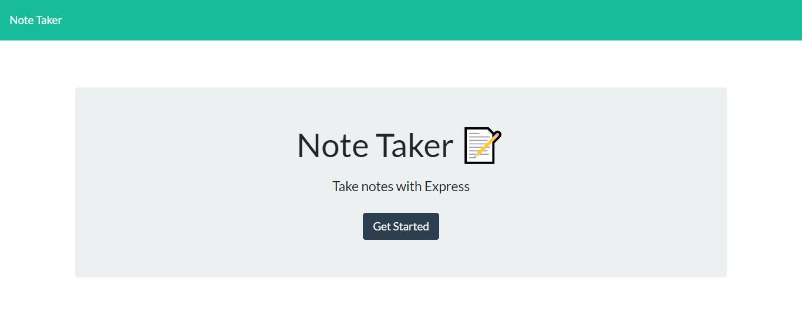

# My amazing-note-taker

## Description

Create an application that can be used to write, save, and delete notes. This application will use an express backend and save and retrieve note data from a JSON file.

## My Deployed App
* [See Heroku Live Site](https://fast-ocean-49135.herokuapp.com/)

## Screeshots

Homepage displaying last workout

## Approach
As the front end was already created, I needed to look at connecting this to the backend. I broke down the problem into smaller objectives:
1. Start a server using Express
2. Link the HTML to get and post requests in the backend JavaScript
3. Write the user's notes to the server's JSON file with unique IDs
4. The post method needs to write the note to the JSON file for retrieval
5. The get method needs to retrieve notes from the server for viewing
6. The delete method needs to locate and delete specific notes from the server

## Challenges
* Learning how to use Store class and other help functions.

* understanding pathing with Express, creating unique ID according to its position, and deleting function with filter. 

